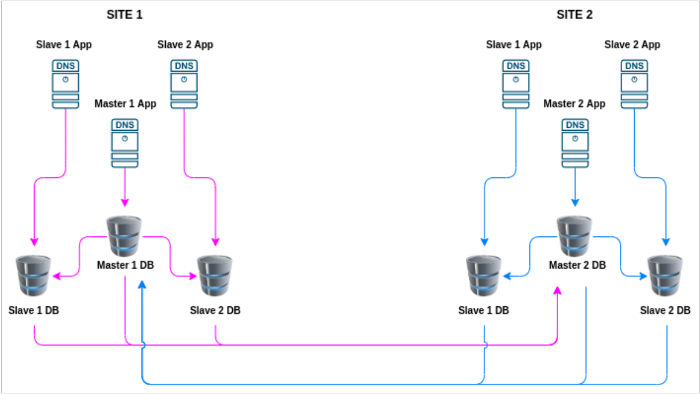

# SmartDNS: SmartDNS setup in NPCI.

In the fast-evolving realm of financial technology, maintaining a robust and reliable infrastructure is paramount. At the National Payments Corporation of India (NPCI), where we operate a private datacenter housing thousands of virtual machines (VMs), the imperative for seamless interaction with banks has led to the development of an innovative solution - SmartDNS.


## **The Challenge: Ensuring Uninterrupted Connectivity with Banks**

In the direct interface with banks, providing a consistent and reliable IP address is critical. Swift restoration in the event of downtime is imperative. To tackle this challenge, we conceived and implemented SmartDNS, a dynamic DNS solution designed for load balancing and automated IP assignment based on hostnames.

## **Technologies at the Core:**

### **PowerDNS:**
PowerDNS, a leading provider of secure open-source and commercial DNS software, stands at the core of our SmartDNS solution. Tailored for large-scale DNS service providers, PowerDNS ensures an exceptional user experience, provides DDoS protection, and delivers efficient internet performance for Hosters and ISPs.

### **MariaDB:**
To store DNS entries and ensure high availability through replication, we turned to MariaDB Server. As one of the most popular open-source relational databases, MariaDB is renowned for its performance, reliability, and unwavering commitment to open source principles.

### **Docker:**
Our SmartDNS implementation embraces a container-based setup using Docker, providing flexibility, scalability, and streamlined management for our dynamic DNS infrastructure.

### **PowerDNS DNSdist:**
DNSdist, a unique DNS proxy and load balancer, optimizes DNS traffic in front of the PowerDNS Recursor. Deployed alongside PowerDNS Recursor, it delivers unparalleled performance and features for our DNS services.

### **PowerDNS Recursor:**
As a highly efficient, low-latency DNS caching server, PowerDNS Recursor ensures rapid responses to DNS requests. Focused on faster, safer, and more secure internet performance, it plays a pivotal role in enhancing user experience.

### **PowerDNS-Admin:**
To streamline interactions with PowerDNS, we integrated PowerDNS-Admin as a user interface. Leveraging the PowerDNS API, PowerDNS-Admin offers an intuitive and reliable platform for managing DNS operations seamlessly.

### **SmartDNS Architecture:**
We have the master slave architecture where master is the one for the new DNS entry and slave act as DNS to resolve the hostname.


## **Setup:**
# Setting Up PowerDNS with Docker-Compose

To configure PowerDNS using Docker-Compose, follow these steps:

### 1. Create Docker-Compose File

Open your terminal and create the `docker-compose.yml` file using your preferred text editor. For example:

```bash
vim docker-compose.yml

version: '3'

services:
  db:
    image: mariadb:latest
    environment:
      - MYSQL_ALLOW_EMPTY_PASSWORD=yes
      - MYSQL_DATABASE=powerdnsadmin
      - MYSQL_USER=pdns 
      - MYSQL_PASSWORD=mypdns
    ports:
      - 3306:3306 
    restart: always
    volumes:
      - /pda-mysql:/var/lib/mysql

  pdns:
    image: pschiffe/pdns-mysql
    hostname: pdns
    domainname: computingforgeeks.com
    restart: always
    depends_on:
      - db
    links:
      - "db:mysql"
    ports:
      - "53:53"
      - "53:53/udp"
      - "8081:8081"
    environment:
      - PDNS_gmysql_host=db
      - PDNS_gmysql_port=3306
      - PDNS_gmysql_user=pdns
      - PDNS_gmysql_dbname=powerdnsadmin
      - PDNS_gmysql_password=mypdns
      - PDNS_master=yes 
      - PDNS_api=yes
      - PDNS_api_key=secret 
      - PDNSCONF_API_KEY=secret 
      - PDNS_webserver=yes 
      - PDNS_webserver-allow-from=127.0.0.1,10.0.0.0/8,172.0.0.0/8,192.0.0.0/24 
      - PDNS_webserver_address=0.0.0.0 
      - PDNS_webserver_password=secret2 
      - PDNS_version_string=anonymous 
      - PDNS_default_ttl=1500 
      - PDNS_allow_notify_from=0.0.0.0 
      - PDNS_allow_axfr_ips=127.0.0.1 

  web_app:
    image: powerdnsadmin/pda-legacy:latest
    container_name: powerdns_admin
    ports:
      - "8080:80"
    depends_on:
      - db
    restart: always
    links:
      - db:mysql
      - pdns:pdns
    logging:
      driver: json-file
      options:
        max-size: 50m
    environment:
      - SQLALCHEMY_DATABASE_URI=mysql://pdns:mypdns@db/powerdnsadmin
      - GUNICORN_TIMEOUT=60
      - GUNICORN_WORKERS=2
      - GUNICORN_LOGLEVEL=DEBUG
```
The provided Docker Compose configuration is a template, and you can customize it based on your specific requirements and environment. Here are some considerations and areas you might want to modify:

    Container Names and Hostnames:
        Change the service names (db, pdns, web_app) to names that make sense for your project.
        Adjust the hostname and container_name properties to match your naming conventions.

    Networking and Ports:
        Modify the ports mapping based on your network setup and security considerations.
        Adjust the domain name and IP configurations as needed.

    Database Configuration:
        Change the database environment variables, such as MYSQL_DATABASE, MYSQL_USER, and MYSQL_PASSWORD, to match your database requirements.
        Consider using a more secure approach for passwords, especially in production.

    PowerDNS Configuration:
        Customize the PowerDNS environment variables (PDNS_*) based on your DNS requirements.
        Set a secure value for PDNS_api_key and other sensitive parameters.

    Web Application Configuration:
        Modify the web application environment variables to suit your needs.
        Ensure that the database URI in SQLALCHEMY_DATABASE_URI is correct.

    Volumes and Data Persistence:
        Adjust volume mappings (volumes section) based on your data persistence strategy.
        Consider using named volumes or host paths for better control over data.

    Container Versions:
        Specify the versions of Docker images for each service. You might want to use specific version tags for stability.

    Logging Configuration:
        Customize logging configurations based on your logging preferences.

    Security Considerations:
        Review security best practices and adjust configurations accordingly.
        Use secrets management for sensitive information.

    Comments and Documentation:
        Add comments to the Docker Compose file to document your changes and reasoning.